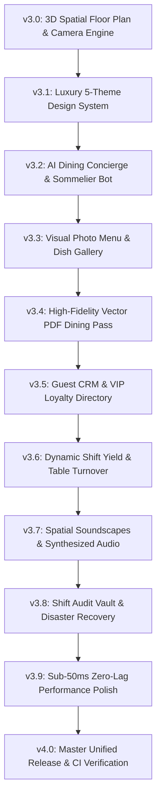

# ⚜️ THE ROYAL SPICE 3.0 — 3D Spatial Restaurant Operations & Table Management OS

[](https://github.com/qamarabbas-024/Restaurant-Booking-Table/actions)
[](https://github.com/qamarabbas-024/Restaurant-Booking-Table)
[](https://github.com/qamarabbas-024/Restaurant-Booking-Table)
[](Code/web/style.css)

> **The Royal Spice 3.0** is an industry-defining **3D Spatial Restaurant Table Management, AI Sommelier & Reservation Operating System** powered by a dual-engine architecture: a high-performance C++17 Core Engine and an immersive, zero-lag Web Companion Platform.

---

## 🌟 Core Pillars & Operational Capabilities

```text
THE ROYAL SPICE 3.0+ ECOSYSTEM
├── 1. 🌌 3D Spatial Floor Plan (Isometric View, Orbit/Tilt/Zoom Camera, 3D Table Nodes)
├── 2. 🤖 AI Dining Sommelier & Concierge (Chef Auguste: Wine Pairings, Instant Booking)
├── 3. 🍷 Visual Photo Menu & Dish Showcase (Michelin 3-Star Catalog with Allergen Tags)
├── 4. 👑 VIP Guest CRM & Loyalty Directory (Visit Frequency, Lifetime Spend, Notes)
├── 5. 📄 High-Fidelity Vector PDF Dining Pass & Run-Sheet (Printable Guest Passes)
├── 6. 🎨 5 Curated Luxury Themes (Imperial Onyx, Royal Emerald, Champagne Pearl, etc.)
├── 7. 🎧 Web Audio Synthesizer (Crystal Toast, Service Bell Chimes, Tactile Feedback)
└── 8. ⚡ C++17 Core REST Server (Zero-Latency File Persistence in tables.txt & bookings.txt)
```

---

## 🚀 Quick Start & 1-Click Launch

### Option 1: Web Companion (Standalone or Live C++ Sync)
Double-click `launch.bat` or run:
```powershell
.\start.ps1
```
Or open [`Code/web/index.html`](Code/web/index.html) in any browser.

### Option 2: Live Embedded C++ REST Companion Server
Compile and launch the embedded HTTP server on port 8080:
```powershell
cd Code
g++ -std=c++17 main.cpp Table.cpp Booking.cpp BookingManager.cpp FileHandler.cpp Utils.cpp Server.cpp -lws2_32 -o system.exe
.\system.exe --serve
```
Open **[http://localhost:8080](http://localhost:8080)** in your browser.

---

## 🎨 5 Curated Luxury Themes
1. **🌌 Imperial Onyx & Gold (Default Dark)**: Deep obsidian canvas with gold leaf accents and champagne highlights.
2. **👑 Royal Emerald Palace**: Deep forest emerald `#031c10` with antique brass highlights.
3. **🥂 Champagne Pearl (Luxury Light)**: Warm ivory `#fdfbf7` with cognac accents and soft alabaster cards.
4. **🌙 Tokyo Midnight Velvet**: Deep sapphire `#03071e` with neon violet glows.
5. **🏛️ Nordic Minimalist Slate**: Scandinavian crisp white `#f8fafc` with charcoal slate typography.

---

## 🗺️ 10-Version Mega Evolution Roadmap (v3.0 to v4.0)



---

## 🧪 Automated Testing
Run the 6/6 automated C++ unit and integration test suites:
```powershell
cd Code
g++ -Wall -Wextra -Wpedantic -std=c++17 test_suite.cpp Table.cpp Booking.cpp BookingManager.cpp FileHandler.cpp Utils.cpp Server.cpp -lws2_32 -o test_suite.exe
.\test_suite.exe
```

---

## 📄 License & Attribution
Designed & Built for fine dining hospitality operators. Licensed under the MIT License.
